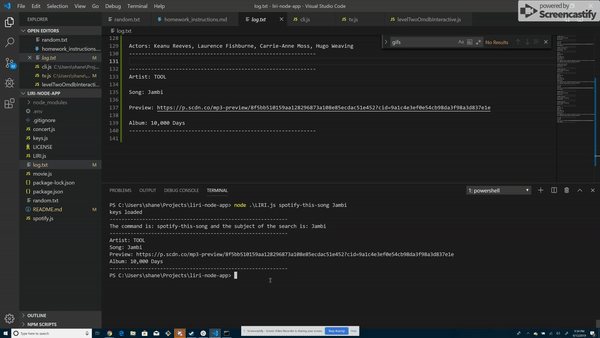

# liri-node-app
Language Interpretation and Recognition Interface

## Overview
This app was created in order to provide the user with a terminal interface for users to use when search for specifics about a future band concerts, a particular song, or a film.

## Organization
This app is broken up into five distinct js files: 
1. `LIRI.js` our root file with builds objects from the imported constructor files and gives them user input 

2. `key.js` our file for holding env keys, 

3. `concert.js` our constructor for interacting with Bands in Town API, 

4. `movie.js` our constructor for interacting with OMDB API

5. `spotify.js` our constructor for interacting with node-spotify-api

### How to Run
The app may be run by typing in the following commands in terminal after downloading all files form the repo:

The basic commands are: concert-this, movie-this, spotify-this-song. 

- node .\LIRI.js concert-this **`<your search subject here>`**
    - searches Bands In Town for Subject

- node .\LIRI.js movie-this **`<your search subject here>`**

    - searches OMDB for Subject

- node .\LIRI.js spotify-this-song **`<your search subject here>`**

    - searches Spotify for Subject

- node .\LIRI.js do-what-it-says

    - uses random.txt to determine which previous command should be used and  what the subject is, please use **`<command>,<subject>`** only once and exactly as described inside random.txt

## Example Gifs:
- Using concert-this

- Using movie-this

- Using spotify-this-song

-Using do-what-it-says

